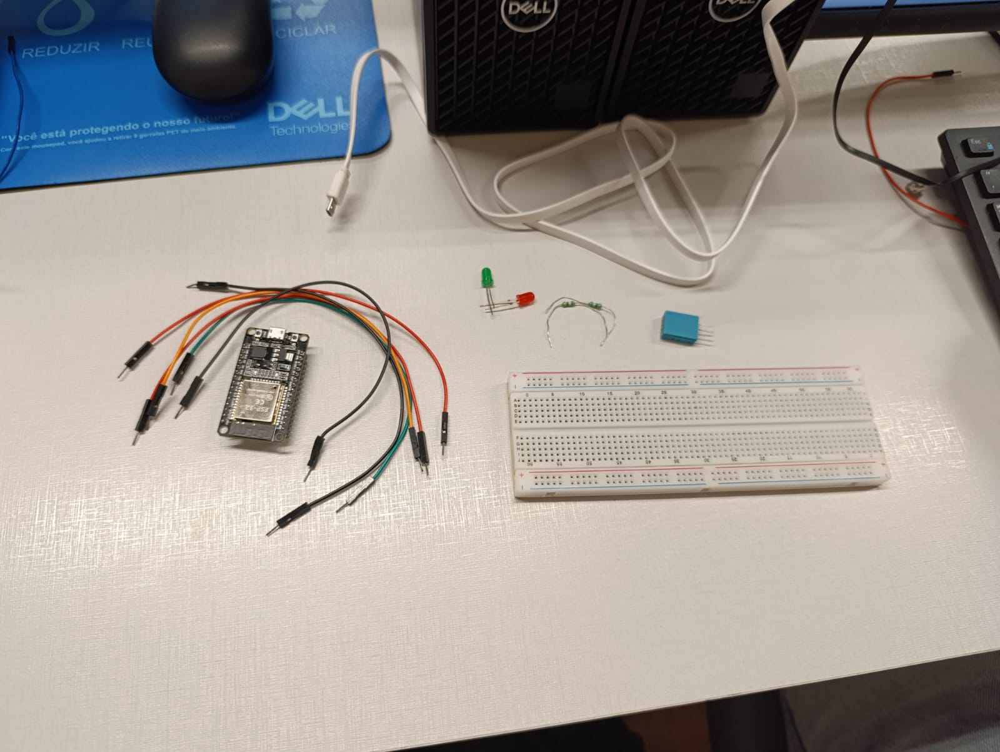
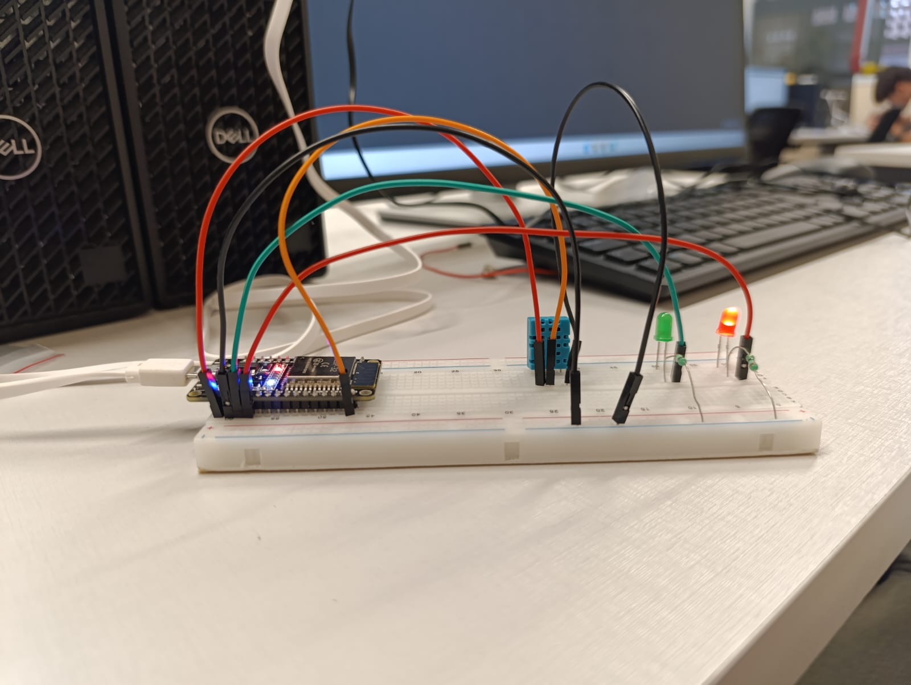

# 🌐 Projeto IoT com ESP32

Este projeto é dividido em **2 mini projetos independentes**, ambos utilizando o **ESP32** como microcontrolador principal:

1. 🔥 **Sensor de Temperatura com LEDs Indicativos**  
2. ⚙️ **Controle de Servo Motor**

---

## 📌 Pré-requisitos

Antes de iniciar, você precisa ter instalado no seu computador:

- [Arduino IDE](https://www.arduino.cc/en/software) ou [PlatformIO](https://platformio.org/)
- Biblioteca do **ESP32** configurada no Arduino IDE
- Conhecimentos básicos de eletrônica (jumpers, resistores, LEDs)

---

## 🔥 Mini Projeto 1: Sensor de Temperatura com LEDs

### 🎯 Objetivo

Montar um sistema que utiliza um **sensor de temperatura** conectado ao ESP32.  
Os LEDs indicam a condição da temperatura:

- 🔴 **LED Vermelho** → Temperatura alta  
- 🟢 **LED Verde** → Temperatura dentro do normal  

---

### 🛠️ Materiais necessários

- 1x ESP32  
- 1x Sensor de Temperatura (ex: **LM35** ou **DHT11**, conforme disponível)  
- 2x LEDs (vermelho e verde)  
- 2x Resistores (220Ω)  
- 6x Jumpers (macho-macho)  
- 1x Protoboard  

---

### 🔌 Montagem

  
  

**Ligaçõ​es principais:**

- **Sensor de Temperatura**  
  - VCC → 3.3V (ESP32)  
  - GND → GND (ESP32)  
  - OUT/DATA → GPIO 34 (ESP32)  

- **LED Verde**  
  - Anodo (+) → GPIO 25 (via resistor 220Ω)  
  - Catodo (-) → GND  

- **LED Vermelho**  
  - Anodo (+) → GPIO 26 (via resistor 220Ω)  
  - Catodo (-) → GND  

---

### 💻 Código de Exemplo (LM35 ou sensor analógico)

```cpp
#define TEMP_PIN 34
#define LED_VERDE 25
#define LED_VERMELHO 26

void setup() {
  Serial.begin(115200);
  pinMode(LED_VERDE, OUTPUT);
  pinMode(LED_VERMELHO, OUTPUT);
}

void loop() {
  int leitura = analogRead(TEMP_PIN);
  float tensao = leitura * (3.3 / 4095.0);
  float temperatura = tensao * 100.0; // Conversão aproximada para LM35 (10mV = 1°C)

  Serial.print("Temperatura: ");
  Serial.println(temperatura);

  if (temperatura > 30) {
    digitalWrite(LED_VERMELHO, HIGH);
    digitalWrite(LED_VERDE, LOW);
  } else {
    digitalWrite(LED_VERDE, HIGH);
    digitalWrite(LED_VERMELHO, LOW);
  }

  delay(1000);
}
```

1 - ⚙️ *** Mini Projeto 2: Servo Motor com ESP32 ***
2 - 🎯 Objetivo
Controlar o movimento de um servo motor usando o ESP32.

🛠️ Materiais necessários
1x ESP32

1x Servo Motor (ex: SG90)

3x Jumpers

1x Protoboard (opcional, apenas para organizar)

🔌 Montagem

Ligações principais:

Servo VCC (vermelho) → 5V (ESP32)

Servo GND (preto/marrom) → GND (ESP32)

Servo Sinal (amarelo/laranja) → GPIO 13 (ESP32)

💻 Código de Exemplo
cpp
Copiar código
#include <ESP32Servo.h>

Servo meuServo;

void setup() {
  meuServo.attach(13); // Pino de controle do servo
}

void loop() {
  for (int pos = 0; pos <= 180; pos += 10) {
    meuServo.write(pos);
    delay(500);
  }
  for (int pos = 180; pos >= 0; pos -= 10) {
    meuServo.write(pos);
    delay(500);
  }
}

